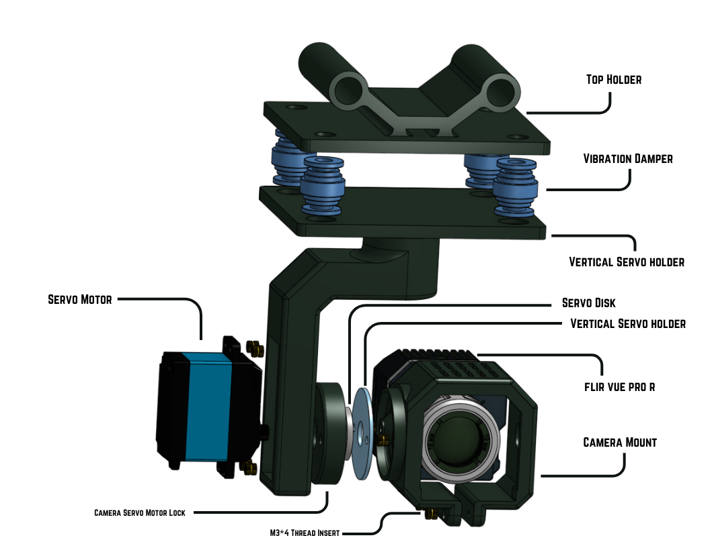
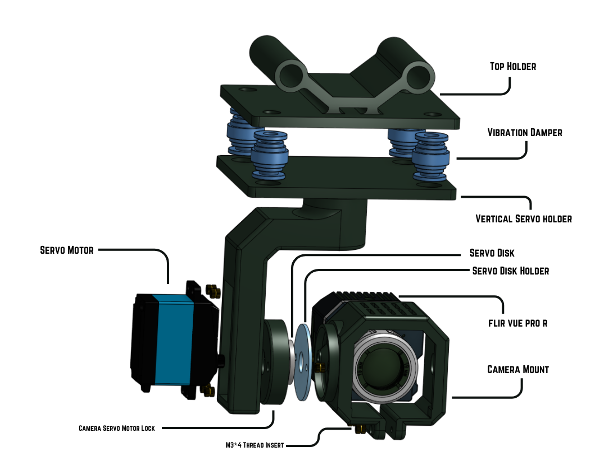

# One Axis Gimbal For Flir view pro R

  It's a custom-designed gimbal for the Flir View Pro R for pitch axis 
  movement.

### Parts of One Axis Gimbal

 - Top Holder.stl
 - Vertical Servo holder.stl
 - Camera Mount.stl
 - Servo Lock Holder.stl
 - Camera Servo Motor Lock.stl
 
For 3D Printing parts [**Download**](/Flir-One-Axis-Gimbal/STL/) files and 3Dprint at optimal settings for strength and light weight.

### For modification 
Download the file [**Flir One Axis Gimbal.step**](/Flir-One-Axis-Gimbal/Flir-One-Axis-Gimbal.step) then import to your cad software(eg. Fusion 360, Onshape) then you can modifiy every parts of the Gimbal.

### Assembly Information
   
For the assembly of gimbal refer the image below.

### Consumables required for Assembly Gimbal

- **Servo Motor** - MG996R Tower Pro Digital Metal Gear High Torque - 1 nos

- **M3*4MM Thread insert** - 8 nos

- **M3*6MM Nut** - 6 nos

- **M3*12MM Nut** - 2 nos

- **Vibration Damper** - 4 nos

Ensure every parts are assembled properly.

